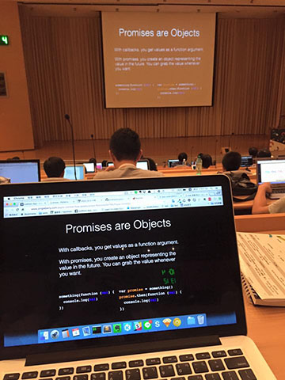
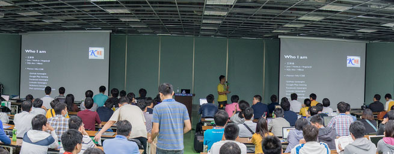

# 模擬投影片在大場所時的觀看狀況 #
 台北 中央研究院人文社會科學館<br>
 高雄 國際會議中心
### 建議 ###
- 高對比的配色
- 黑底千萬不要選用 #0000FF (blue)
- 白底比黑底好
- 字體調大
- IDE 在 live Demo 時改為 light theme，且放大字體
- MAC 有螢幕反相顏色及增強對比的功能，設定 > 輔助使用 > 顯示器 > 反相顏色
  - 開啟快捷鍵 Control-Option-Command-8 ：鍵盤 > 快速鍵 > 輔助使用 > 反相顏色
- ps. 網路受訊號干擾可能性很大，WIFI 可能會連不上

### 以下測試 ###
概略測試遠距離的聽眾觀看投影片受白色光源影響的結果，
實際可能情況
- 模糊 blur(1.3vw) 
- 投射顏色變淺 opacity(0.8)
- 受到環境光影響 (這部分不準確，因為光學跟色彩學原理是相反的)
  - 白光 rgba(206, 235, 255, 0.3) 偏藍色調
  - 黃光可改用 rgba(255, 216, 63, 0.3)

### 儲存到瀏覽器的 bookmark 內執行 ###
白光
```
javascript:(function(){var e=document.body;e.style.webkitFilter="blur(0.13vw)",e.style.filter="blur(0.13vw)",e.style.opacity="0.8";var t=document.createElement("div");t.style.position="fixed",t.style.top=0,t.style.left=0,t.style.zIndex=99,t.style.height="100%",t.style.width="100%",t.style.backgroundColor="rgba(206,235,255,0.3)",t.style.pointerEvents="none",e.appendChild(t)})();
```
黃光
```
javascript:(function(){var e=document.body;e.style.webkitFilter="blur(0.13vw)",e.style.filter="blur(0.13vw)",e.style.opacity="0.8";var t=document.createElement("div");t.style.position="fixed",t.style.top=0,t.style.left=0,t.style.zIndex=99,t.style.height="100%",t.style.width="100%",t.style.backgroundColor="rgba(255,216,63,0.3)",t.style.pointerEvents="none",e.appendChild(t)})();
```
